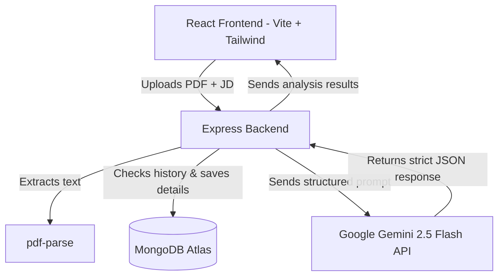

# AI Resume Analyzer - Resume Evaluator & ATS Optimizer

AI Resume Analyzer is a production-ready, full-stack web application designed to evaluate PDF resumes against job descriptions. Built using the MERN stack (MongoDB, Express, React, Node.js) and the Google Gemini 2.5 Flash model, it delivers instantaneous, actionable insights—including ATS Match Scores, missing skills, keyword analysis, suggestion roadmaps, and tailored professional summaries.

---

## Architecture Overview



---

## Features

- **Direct PDF Text Extraction**: Uses `pdf-parse` to read resume text without saving files permanently (automatic filesystem cleanup).
- **AI-Powered Evaluation**: Incorporates the `gemini-2.5-flash` model with strict JSON outputs for highly reliable scores.
- **Detailed Skill Gap & Keyword Tracking**: Computes overall ATS score, matched vs. missing keywords, and missing skills.
- **4-Week Actionable Roadmap**: Generates weekly modules and study targets to close technical/professional gaps.
- **Tailored Summary Engine**: Instant generation of resume-ready summaries aligned directly to job requirements.
- **Searchable Report History**: Keep track of previous evaluation runs. Simple filter by file name and delete entries dynamically.

---

## Tech Stack

### Frontend
- **React 19** (scaffolded via Vite)
- **Tailwind CSS v4** (utility-first, zero-config styling engine)
- **React Router DOM** (declarative client routing)
- **Axios** (REST client with upload progress hooks)
- **Lucide React** (modern iconography)

### Backend
- **Node.js** (built with modern ES Modules `import/export`)
- **Express.js** (REST API framework)
- **Multer** (multipart upload handler)
- **pdf-parse** (PDF parser)
- **Mongoose** (MongoDB modeling schema)

### Database
- **MongoDB Atlas** (cloud document database)

### AI Service
- **Google Gemini API** (using the new `gemini-2.5-flash` model)

---

## Folder Structure

```
├── client/
│   ├── src/
│   │   ├── components/      # UI components (Navbar, ScoreCard, DragDropUpload...)
│   │   ├── pages/           # Pages (LandingPage, UploadPage, DashboardPage, HistoryPage)
│   │   ├── services/        # Axios API configurations
│   │   ├── index.css        # Tailwind directives and custom scrollbar overrides
│   │   ├── main.jsx         # React entrypoint
│   │   └── App.jsx          # Route declarations
│   ├── index.html
│   ├── vite.config.js       # Vite configuration containing React & Tailwind plugins
│   └── package.json
│
├── server/
│   ├── config/              # Database connection setups
│   ├── controllers/         # Thin handlers (analysisController, historyController)
│   ├── middleware/          # Upload validations & central error handlers
│   ├── models/              # Schema validations (ResumeAnalysis)
│   ├── routes/              # Express API routing declarations
│   ├── services/            # Business logic (analysisService, geminiService)
│   ├── uploads/             # Temp upload directory
│   ├── server.js            # Node startup script
│   └── package.json
│
├── .env.example             # Global environment configurations
├── LICENSE                  # Open-source MIT license details
├── README.md                # Project documentation
└── package.json             # Root monorepo workspace runner
```

---

## Installation & Setup

### Prerequisites
- [Node.js](https://nodejs.org) (v18 or higher)
- [MongoDB Atlas](https://www.mongodb.com/cloud/atlas) account (or a local MongoDB instance)
- [Google AI Studio Gemini API Key](https://aistudio.google.com)

### 1. Clone & Initialize Workspace
Create a `.env` file inside the `server/` directory:
```bash
cd server
cp .env.example .env
```

Open `server/.env` and update the keys:
```env
PORT=5000
MONGO_URI=your_mongodb_connection_string
GEMINI_API_KEY=your_gemini_api_key
CLIENT_URL=http://localhost:5173
```

### 2. Install Dependencies
Run the command below in the root folder to install dependencies for both the frontend and backend concurrently:
```bash
npm run install-all
```

### 3. Run Frontend & Backend
Start both the React development client and the Node backend server concurrently by running:
```bash
npm run dev
```
- **React Frontend**: [http://localhost:5173](http://localhost:5173)
- **Express Backend**: [http://localhost:5000](http://localhost:5000)

---

## API Endpoints

### 1. Backend Health Check
- **Endpoint**: `GET /health`
- **Response**:
```json
{
  "status": "ok",
  "timestamp": "2026-07-08T13:00:00.000Z"
}
```

### 2. Evaluate Resume
- **Endpoint**: `POST /api/analyze`
- **Content-Type**: `multipart/form-data`
- **Request Body**:
  - `resume`: PDF File (binary)
  - `jobDescription`: Job Description (string)
- **Response** (201 Created):
```json
{
  "success": true,
  "message": "Analysis completed successfully",
  "data": {
    "_id": "64f9c892fa4de19db12f60ad",
    "fileName": "Resume.pdf",
    "jobDescription": "React developer...",
    "overallScore": 85,
    "strengths": ["React Hooks experience", "Tailwind CSS"],
    "missingSkills": ["Testing with Jest"],
    "missingKeywords": ["Jest", "Webpack"],
    "matchedKeywords": ["React", "Express", "Node.js"],
    "improvementSuggestions": ["Add detail about metrics in projects"],
    "improvedSummary": "Detail-oriented React developer...",
    "skillGapRoadmap": [
      {
        "week": "Week 1",
        "topic": "Jest Testing",
        "tasks": ["Read official docs", "Write unit tests"]
      }
    ],
    "finalVerdict": "Very strong candidate, minor additions recommended.",
    "createdAt": "2026-07-08T13:00:00.000Z",
    "updatedAt": "2026-07-08T13:00:00.000Z"
  }
}
```

### 3. Retrieve All History
- **Endpoint**: `GET /api/history`
- **Query Params**: `search` (optional file name filter)
- **Response** (200 OK):
```json
{
  "success": true,
  "count": 1,
  "data": [
    {
      "_id": "64f9c892fa4de19db12f60ad",
      "fileName": "Resume.pdf",
      "overallScore": 85,
      "finalVerdict": "Very strong candidate, minor additions recommended.",
      "createdAt": "2026-07-08T13:00:00.000Z"
    }
  ]
}
```

### 4. Retrieve Specific Report Detail
- **Endpoint**: `GET /api/history/:id`
- **Response** (200 OK):
```json
{
  "success": true,
  "data": { ... full details ... }
}
```

### 5. Delete Report
- **Endpoint**: `DELETE /api/history/:id`
- **Response** (200 OK):
```json
{
  "success": true,
  "message": "Analysis report deleted successfully",
  "data": { "id": "64f9c892fa4de19db12f60ad" }
}
```

---

## Screenshots

*Screenshots demonstrating the visual interface will be added here upon deployment.*

---

## Future Improvements
- **Multi-File Uploads**: Evaluate multiple resumes side-by-side.
- **DOCX / Text formats**: Extend parsing capabilities to cover Microsoft Word resumes.
- **Interactive Roadmap Tracker**: Let users check off tasks completed in their skill gap roadmap.

---

## License

This project is licensed under the MIT License. See the [LICENSE](LICENSE) file for details.
